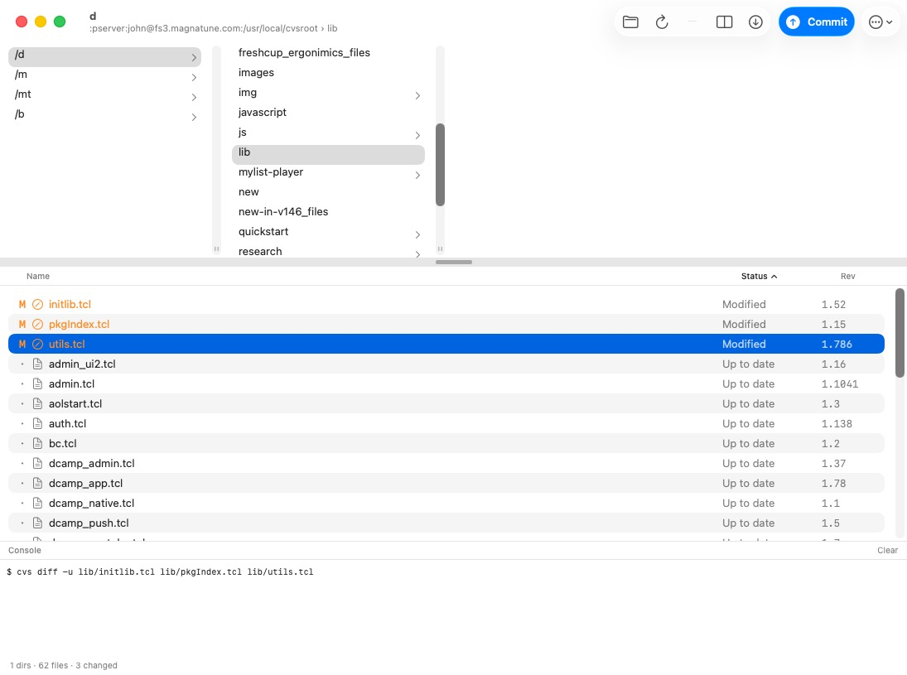
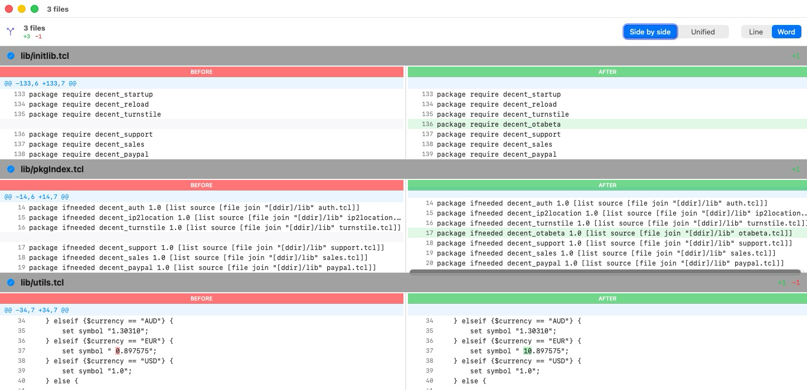

# MacCVS

A modern, native **CVS client for macOS**, written in SwiftUI. A spiritual
successor to the classic [MacCVS / cvsgui](https://cvsgui.sourceforge.net) — which
was a PowerPC/Carbon app that has been unrunnable since macOS Catalina removed
Carbon and 32-bit support. MacCVS is a fresh, universal (Apple Silicon + Intel),
notarized app that drives your existing `cvs` command-line tool.



## Why

CVS is old, but plenty of long-lived projects still live in it. The good graphical
clients were left behind years ago:

- **MacCVS (cvsgui)** — Carbon/PowerPlant, dead since Catalina.
- **gCVS** — GTK2 + libglade, a multi-day dependency-porting project on modern macOS.
- **TkRev/TkCVS** — still works (Tcl/Tk), but not a native Cocoa app.

MacCVS is a small native app that wraps the `cvs` CLI you already have and gives it
a fast, modern macOS front end.

## Features

- **Finder-style column browser** for the directory hierarchy (real `NSBrowser`).
  The first column is a **project switcher** listing the CVS working copies you've
  opened; right-click to *Forget* one or reveal it in Finder.
- **File list** showing every file's **CVS status and revision**, with sortable
  Name / Status / Rev columns.
- **Instant local change detection.** A file's modified state is determined by
  comparing its modification time to the timestamp CVS recorded in `CVS/Entries` —
  exactly how `cvs` decides — with **no network round-trip**. An FSEvents watcher
  flips files to *Modified* the moment you save.
- **Instant diffs.** When a file changes, its base revision is fetched in the
  background and cached, so opening a diff is immediate (no waiting on the server).
- **Native side-by-side diff window** (see below): line- or **word-level**
  highlighting, a unified-view toggle, a **draggable center divider**, and
  multi-file diffs in one window. The window auto-sizes to fit the content.
- **Core CVS operations**: Update, Commit (with a per-file picker), Diff, Log,
  Add, Revert (`update -C`).
- **History window**: `cvs log` is parsed into a clean timeline of revisions
  (revision, author, date, ± line counts, message). A **Show diffs** toggle loads
  the visual diff each revision introduced, inline and on demand.
- **View filters**: hide dot-files and non-CVS files by default, toggle from the
  View menu (⌘⇧. and ⌘⇧U).
- Remembers your **last project and directory** across launches.
- **Automatic updates**: once a day MacCVS checks GitHub Releases; if a newer
  build exists it offers to update, then downloads it, verifies it is notarized,
  and relaunches into the new version. Also available on demand from the app menu
  (*MacCVS ▸ Check for Updates…*).

## The diff viewer



The diff viewer is a standalone, resizable window. Its data model and side-by-side
visual style are adapted from [swifty-diff](https://github.com/michaelneale/swifty-diff)
(MIT); MacCVS adds a `cvs diff` parser, a real window, a unified-view toggle, a
draggable divider, and **word-level** (intra-line) highlighting.

- **Side by side / Unified** toggle.
- **Line / Word** toggle — Word highlights only the changed tokens within a line.
- Drag the **center divider** to rebalance the two panes; each pane scrolls its
  own long lines while vertical scrolling stays in sync.
- Select several modified files and **Diff** them all into one window.

## Requirements

- macOS 14 (Sonoma) or later.
- **Nothing else** — MacCVS **bundles its own `cvs`**. You do not need to install
  CVS. A self-contained universal CVS 1.11.23 client ships inside the app
  (`Contents/Resources/cvs`, linking only the system libraries), and MacCVS
  always uses that one, never the system's `cvs`. See
  [THIRD-PARTY.md](THIRD-PARTY.md) and `build-cvs.sh` for how it's built.

## Install

Download the latest notarized build from the
[Releases](https://github.com/johnbuckman/MacCVS/releases) page, unzip, and drag
**MacCVS.app** to your Applications folder.

## Build from source

```sh
git clone https://github.com/johnbuckman/MacCVS.git
cd MacCVS
swift build -c release          # or: ./build.sh  (assembles a universal .app)
```

`build.sh` produces a universal (arm64 + x86_64) `MacCVS.app`. Notarized releases
are produced with `release.sh` (Developer ID signing + `notarytool`).

## Command line

MacCVS accepts a few command-line options, so it can be scripted or used as a
graphical diff viewer by other programs. Invoke the executable inside the bundle
(or `open -a MacCVS --args …`):

```sh
MacCVS=/Applications/MacCVS.app/Contents/MacOS/MacCVS

"$MacCVS" /path/to/workingcopy      # open a working copy
"$MacCVS" --open /path/to/workingcopy
"$MacCVS" --diff FILE...            # CVS diff (repo vs working) of one or more files
"$MacCVS" --diff lib/a.tcl lib/b.tcl lib/c.tcl   # several files, one window
"$MacCVS" --compare LEFT RIGHT      # visual diff between two arbitrary files
"$MacCVS" --help
```

`--diff` accepts **any number of files** and shows all of their CVS diffs together
in one window. In `--diff`/`--compare` mode MacCVS shows **only** the diff window
(no main window) and quits when it is closed — so another program can call it to
display a diff, e.g. as a git difftool (which passes two files to compare):

```sh
git config --global difftool.maccvs.cmd \
  '/Applications/MacCVS.app/Contents/MacOS/MacCVS --compare "$LOCAL" "$REMOTE"'
git difftool -t maccvs
```

## Architecture

MacCVS is a thin GUI over the `cvs` CLI — it never re-implements the CVS protocol.

- `CVSService` execs the **bundled** `cvs` directly via `Process` (no shell), and
  computes local modified-state from `CVS/Entries` timestamps.
- `WorkingCopyStore` is the app state (`@MainActor` `ObservableObject`): the file
  list, the FSEvents watcher, the base-revision prefetch cache, and all operations.
- `DirectoryColumnBrowser` wraps `NSBrowser` for the column view + project switcher.
- `SwiftyDiff` holds the diff model, the unified-diff parser, word-level diffing,
  and the SwiftUI diff window.

## Credits & license

MacCVS is licensed under the **GNU General Public License v3.0** (see `LICENSE`).

It bundles **GNU CVS 1.11.23** (GPL-2-or-later) as a separate executable, and the
diff viewer adapts the model and visual style of
[swifty-diff](https://github.com/michaelneale/swifty-diff) by Michael Neale (MIT).
See [THIRD-PARTY.md](THIRD-PARTY.md).
